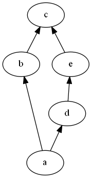
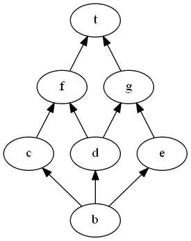

Lattice
=======

Create your own lattice
-----------------------

* Manually

You can define your own (small) lattice by creating its nodes and edges.

Exemple : the non-modular lattice $M_5$ can be defined as follow :

1. Call the empty constructor `Lattice l = new Lattice();`
2. Add nodes :

~~~Java
Node a = new Node('a'); l.addNode(a);
Node b = new Node('b'); l.addNode(b);
Node c = new Node('c'); l.addNode(c);
Node d = new Node('d'); l.addNode(d);
Node e = new Node('e'); l.addNode(e);
~~~

3. Add edges :

~~~Java
Edge ab = new Edge(a, b); l.addEdge(ab);
Edge bc = new Edge(b, c); l.addEdge(bc);
Edge ad = new Edge(a, d); l.addEdge(ad);
Edge de = new Edge(d, e); l.addEdge(de);
Edge ec = new Edge(e, c); l.addEdge(ec);
~~~

You can now verify your lattice with two following methods :

1. A string representation on the standard output : `System.out.println(l.toString());`
2. An export in .dot format file : `l.writeDot("M5.dot");`

Note that these two last methods are inherited from `DGraph`.

Generated `M5.dot` contains :

    digraph G {
        Graph [rankdir=BT]
        90 [label="a"]
        91 [label="b"]
        92 [label="c"]
        93 [label="d"]
        94 [label="e"]
        90->91
        90->93
        91->92
        93->94
        94->92
    }

With [graphviz tools](http://www.graphviz.org/), you can generate the following `.png` image :

* From `LatticeFactory`

LatticeFactory class provides few methods to get example lattices :

1. Call `Lattice b = LatticeFactory.booleanAlgebra(13);` to get boolean algebra with $2^13$ elements in variable `b`.
2. Call `Lattice p = LatticeFactory.permutationLattice(7);` to get lattice of permutation of the set $\{1,\ldots,7\}$ in variable `p`.
3. Call `Lattice r = LatticeFactory.randomLattice(19);` to get a random lattice with $19$ nodes in variable `r`.
4. Call `Lattice p = LatticeFactory.product(l, r);` to get cartesian product lattice $l \times r$ in variable `p`.
5. Call `Lattice d = LatticeFactory.doublingConvex(l, c);` to get lattice in which convex $c$ of lattice $l$ has been doubled in variable `d`.

* From wherever you want

1. From a context, you can generate a `ConceptLattice` which is of course a lattice, by calling `context.conceptLattice(true);`. [INSERT LINK TO CONCEPTLATTICE TUTORIAL]
2. From an implicational system, via `BijectiveComponent`.[INSERT LINK TO BIJECTIVECOMPONENT TUTORIAL]

Basic computations
------------------

Suppose you have your own lattice in variable l and you want to explore its properties.

As an example, we'll use lattice $M_5$ previoulsy defined.

* Top element

Let's begin with a very basic computation : the top element. 

To do, use the following code : `Node top = l.top();`. Of course, you can output its content with `System.out.println(top.toString());`.

In our example, with $M_5$, top element is $c$.

Recall that top is at the top of the representation but it is the smallest element.

* Bottom element

Continue with the dual of top element : the bottom element. 

Use the following code : `Node bot = l.bottom();`.

In our example, with $M_5$, bottom element is $a$.

* Meet of two elements

Here are main properties of lattices. A lattice is a partially ordered set (a.k.a. poset) in which least upper bound (l.u.b. or join) and greatest lower bound (g.l.b. or meet) of two elements exists.

Go on with our $M_5$ example, meet of nodes $b$ and $d$ is $a$. It can be computed with the following code : `Node m = l.meet(b, d);`.

* Join of two elements

Still with $M_5$ example, join of nodes $b$ and $d$ is $c$. It can be computed with the following code : `Node j = l.join(b, d);`.

Irreductibles computations
--------------------------

* Irreductible elements

Irreductible elements are of great importance in lattices. 

Recall a join irreductible $j$ in a lattice $l$ is a special element that can NOT be obtained as a join of others. Of course, meet irreductibility is the dual notion.

A nice caracterization of join irreductible is the following : $j$ is a join irreductible if and only if it has only one predecessor, usually noted $j^-$.

Dually, $m$ is a meet irreductible if and only if it has only one successor, usually noted $m^+$.

You can compute the set of join irreductibles of a lattice $l$ with `TreeSet<Node> joinIrr = l.joinIrreductibles();`.

Dually, you can compute the set of meet irreductibles of a lattice $l$ with `TreeSet<Node> meetIrr = l.meetIrreductibles();`.

In the previous example $M_5$, nodes $b$, $d$, $e$ are join and meet irreductibles.

* New example

Consider the all new lattice :

~~~Java
Lattice l = new Lattice();
Node b = new Node('b'); l.addNode(b);
Node c = new Node('c'); l.addNode(c);
Node d = new Node('d'); l.addNode(d);
Node e = new Node('e'); l.addNode(e);
Node f = new Node('f'); l.addNode(f);
Node g = new Node('g'); l.addNode(g);
Node t = new Node('t'); l.addNode(t);
Edge bc = new Edge(b, c); l.addEdge(bc);
Edge bd = new Edge(b, d); l.addEdge(bd);
Edge be = new Edge(b, e); l.addEdge(be);
Edge cf = new Edge(c, f); l.addEdge(cf);
Edge df = new Edge(d, f); l.addEdge(df);
Edge dg = new Edge(d, g); l.addEdge(dg);
Edge eg = new Edge(e, g); l.addEdge(eg);
Edge ft = new Edge(f, t); l.addEdge(ft);
Edge gt = new Edge(g, t); l.addEdge(gt);
~~~

Such lattice is better understood with a nice picture :

Here, join irreductibles are $c$, $d$ and $e$ whereas meet irreductibles are $c$, $d$, $f$ and $g$

* Irreductible generators

Given a node $n$ which is NOT a join irreductible, you can compute join irreductibles such that $n$ is join of these elements.

For example, with our new example, node $f$ is generated with two join irreductibles $c$ and $d$, computed with `TreeSet<Comparable> joingen = l.joinIrreducibles(f);`.

Dually, `TreeSet<Comparable> meetgen = l.meetIrreducibles(d);` show that node $d$ is obtained as meet of $f$ and $g$ that are meet irreductibles.

To conclude on these irreductibles, you can compute the subgraph of all irreductibles with `DAGraph dag = l.irreduciblesSubgraph();`, and get following result :

[Irreductible Graph](images/IrreductibleGraph.png)

And, last but not least, you can compute the context :

        Observations: c e f g 
        Attributes: c d e 
        c : c 
        e : e 
        f : c d 
        g : d e 

in which observations are meet irreductibles, attributes are join irreductibles, and an attribute is extent of an observation when its join irreducible node is greater than the meet irreducible node in the lattice.

That computation is done by `Context ctx = l.getTable();`.

Closure computations
--------------------

* irreductibleClosure

* joinClosure

* meetClosure

Implicational System computations
---------------------------------

* IS

* Min Gen

* DG

* CDB

Arrow computations
------------------
