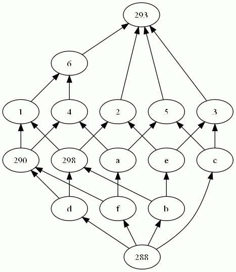

This package both provides classes to manipulate a binary table (or a context) and its concept lattice ; a set of rules (or an implicational system) and its closed set lattice, but also capitalizes on results issued from lattice theory stating that there exists bijective links between lattices, reduced contexts and canonical direct basis of rules (see figure).

Description
-----------

This package both provides classes to manipulate a binary table (or a context) and its concept lattice; a set of rules (or an implicational system) and its closed set lattice, but also capitalizes on results issued from lattice theory stating that there exists bijective links between lattices, reduced contexts and canonical direct basis of rules (see figure).

A context is defined by class `Context` that provides methods implementing classical operations on a context, as the reduction for example.
An implicational system, defined by class `IS`, provides methods for classical transformations of an implicational system, and in particular
methods generating the canonical basis and the canonical direct basis of an IS. A context and an implicational system both have as common behavior to
own properties of a closure system. Indeed, the closed set lattice is defined for any closure system using the main closure operation.
The abstract class `ClosureSystem` provides both abstract and non abstract methods for a closure system and the closed set lattice generation.
In this package, this abstract class is derivated by classes `Context` and `IS`.

A context and an implicational system can be instancied from and save to a text file in the following format:

* Context:

        Observations: 1 2 3
        Attributes: a b c d e
        1 a c
        2 a b
        3 b d e
        4 c e

* Implicational system:

        a b c d e
        a b -> c d
        c d -> e

A lattice is defined by class `Lattice`, and is derivated by class `Conceptlattice` for the special case of both concept lattice and closed set
lattice. Since a lattice is a directed acyclic graph, class `DGraph` and class `DAGraph` respectively represent a directed graph and a directed acyclic graph, and provides some specific methods to manipulate theses structures.

The standard representation by sets of successors and predecessors is used to represent a graph. Any graph can be saved in a dot file, and visualized using
<a href="http://www.graphviz.org/" target="_blank">graphviz tools</a>. The classes `Node` and `Edge` are encapsulated in a directed graph. The class `Concept` extends the class `Node` by defining as fields the two sets defining a concept, and is used by class `CoonceptLattice`. The class `Concept` can be instancied for a closed set by using only one of the two sets.

The `TreeSet` container is used to store nodes, edges, rules or concepts, allowing to invoke set operations (member, inclusion, union, intersection, ...). All these elements have then to be comparable by implementing the `Comparable` class. This package also provides class `ComparableSet` that gives a minimal representation for sets that can be sorted using the famous lectic order. Therefore, a comparable set can also be stored in a sorted set where set operations are provided.

### Examples

The main class of this package is the class `BijectiveComponents` that generates bijective components for a given closure system. These bijective components are (see figure):
* the closed set lattice of the closure system ;
* the table of the lattice ;
* the canonical direct basis of the lattice that encodes
  - the dependance graph of the lattice encoding,
  - the minimal generators of the lattice and
  - the canonical basis of the lattice.

Consider the following instanciation of the main class `BijectiveComponents`:

~~~Java
BijectiveComponents BC = new BijectiveComponents (initialClosureSystem);
BC.initialise();
BC.save(dirString,nameString);
~~~

The following table illustrates the generated bijective components when the inital closure is a context and when it is an implicational system.

#### When the initial closure system is a context:

##### Initial closure system:

    Observations: 1 2 3 4 5 6
    Attributes: a b c d e f
    1 : b d f
    2 : b d e
    3 : b c e
    4 : a d f
    5 : a c f
    6 : a b d f

##### Concept lattice

##### Reduced lattice

##### Dependance graph

##### Canonical basis

    a b c d e f
    e  -> b
    c f  -> a
    c d  -> a b e f
    b f  -> d
    b d e f  -> a c
    b c  -> e
    a  -> f

##### Reduced table

    Observations: 1 6 4 5 2 3
    Attributes: f a d c b e
    1 : f d b
    6 : f a d b
    4 : f a d
    5 : f a c
    2 : d b e
    3 : c b e

##### Canonical direct basis </TH>

    a b c d e f
    e  -> b
    e f  -> a c d
    c f  -> a
    c d  -> a b e f
    b f  -> d
    b c  -> e
    a  -> f
    a e  -> c d
    a b  -> d

##### Minimal generators </TH>

    [[e], [e, f], [c, f], [c, d], [b, f], [b, c], [a], [a, e], [a, b]]

#### When the initial closure system is an implicational system:

##### Initial closure system

    a b c d e g
    d  -> e g
    c  -> a
    c g  -> b d
    c e  -> g
    c d  -> b
    b e  -> c
    b c  -> d
    a b  -> c

##### Concept lattice

##### Reduced lattice

##### Dependance graph

##### Canonical basis

    a b c d e g
    d  -> e g
    c  -> a
    b e  -> a c d g
    a c g  -> b d e
    a c e  -> b d g
    a b  -> c d e g

##### Reduced table

    Observations: d 557 559 560 561 563 b c
    Attributes: g d e b a c
    d : g d e
    557 : g d e a
    559 : g e a
    560 : g b
    561 : g a
    563 : e a
    b : b
    c : a c

##### Canonical direct basis

    a b c d e g
    d  -> e g
    c  -> a
    c g  -> b d e
    c e  -> b d g
    c d  -> b
    b e  -> a c d g
    b d  -> a c
    b c  -> d e g
    a b  -> c d e g

##### Minimal generators

    [[d], [c], [c, g], [c, e], [c, d], [b, e], [b, d], [b, c], [a, b]]

@startuml UML.png

title Main UML graph

!include resources/org/thegalactic/dgraph/DGraph.iuml
!include resources/org/thegalactic/dgraph/Edge.iuml
!include resources/org/thegalactic/dgraph/DAGraph.iuml
!include resources/org/thegalactic/dgraph/Node.iuml

!include resources/org/thegalactic/util/Couple.iuml
!include resources/org/thegalactic/util/ComparableSet.iuml
!include resources/org/thegalactic/context/Context.iuml
!include resources/org/thegalactic/lattice/Concept.iuml
!include resources/org/thegalactic/lattice/ConceptLattice.iuml
!include resources/org/thegalactic/lattice/ArrowRelation.iuml
!include resources/org/thegalactic/lattice/ClosureSystem.iuml
!include resources/org/thegalactic/lattice/Lattice.iuml
!include resources/org/thegalactic/lattice/Rule.iuml
!include resources/org/thegalactic/lattice/BijectiveComponents.iuml
!include resources/org/thegalactic/lattice/ImplicationalSystem.iuml
!include resources/org/thegalactic/lattice/LatticeFactory.iuml

hide members
@enduml

@startuml Context-IO.png

title Context Input/Output UML graph

!include resources/org/thegalactic/context/io/ContextSerializerBurmeister.iuml
!include resources/org/thegalactic/context/io/ContextSerializerCsv.iuml
!include resources/org/thegalactic/context/io/ContextIOFactory.iuml
!include resources/org/thegalactic/context/io/ContextSerializerFIMI.iuml
!include resources/org/thegalactic/context/io/TextSerializer.iuml
!include resources/org/thegalactic/io/IOFactory.iuml
!include resources/org/thegalactic/io/Reader.iuml
!include resources/org/thegalactic/io/Writer.iuml

hide members
@enduml

@startuml DGraph-IO.png

title DGraph Input/Output UML graph

!include resources/org/thegalactic/dgraph/io/DGraphWriter.iuml
!include resources/org/thegalactic/dgraph/io/DGraphWriterFactory.iuml
!include resources/org/thegalactic/dgraph/io/DGraphWriterDot.iuml
!include resources/org/thegalactic/io/IOFactory.iuml
!include resources/org/thegalactic/io/Reader.iuml
!include resources/org/thegalactic/io/Writer.iuml

hide members
@enduml

@startuml Lattice-IO.png

title Input/Output UML graph

!include resources/org/thegalactic/lattice/io/ArrowRelationWriter.iuml
!include resources/org/thegalactic/lattice/io/ArrowRelationWriterFactory.iuml
!include resources/org/thegalactic/lattice/io/ArrowRelationWriterTeX.iuml
!include resources/org/thegalactic/lattice/io/ConceptLatticeWriterDot.iuml
!include resources/org/thegalactic/lattice/io/ConceptLatticeWriterFactory.iuml
!include resources/org/thegalactic/lattice/io/ConceptLatticeWriter.iuml
!include resources/org/thegalactic/lattice/io/ImplicationalSystemReader.iuml
!include resources/org/thegalactic/lattice/io/ImplicationalSystemReaderFactory.iuml
!include resources/org/thegalactic/lattice/io/ImplicationalSystemReaderText.iuml
!include resources/org/thegalactic/lattice/io/ImplicationalSystemWriter.iuml
!include resources/org/thegalactic/lattice/io/ImplicationalSystemWriterFactory.iuml
!include resources/org/thegalactic/lattice/io/ImplicationalSystemWriterText.iuml
!include resources/org/thegalactic/io/IOFactory.iuml
!include resources/org/thegalactic/io/Reader.iuml
!include resources/org/thegalactic/io/Writer.iuml

hide members
@enduml

